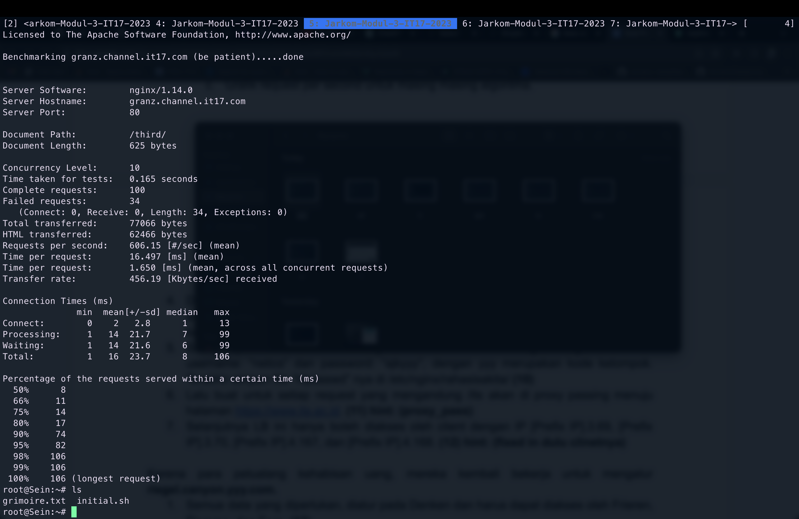
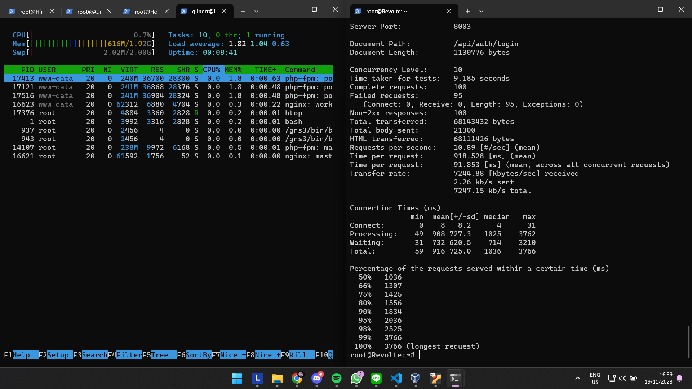

# # Jarkom-Modul-3-IT17-2023

Laporan resmi dari modul ketiga mata kuliah Komunikasi Data dan Jaringan Komputer IT ITS 2023.

## Authors

| NRP        | Nama                       |
| :--------  | :------------------------  |
| 5027211038 | Ahnaf Musyaffa             |
| 5027211056 | Gilbert Immanuel Hasiholan |


## Penjelasan

### Soal 0
Instalasi dan konfigurasi ip


```sh
echo "nameserver 192.168.122.1" > /etc/resolv.conf
apt-get update
apt-get install bind9 -y
```

Menambahkan DNS zone configurations to /etc/bind/named.conf.local untuk dua domain yaitu riegel dan granz

```sh
echo '
zone "riegel.canyon.it17.com" {
  type master;
  file "/etc/bind/it17_modul3/riegel.canyon.it17.com";
};

zone "granz.channel.it17.com" {
  type master;
  file "/etc/bind/it17_modul3/granz.channel.it17.com";
};
' > /etc/bind/named.conf.local

mkdir -p /etc/bind/it17_modul3

echo ';
; BIND data file for local loopback interface
;
$TTL    2022100601
@       IN      SOA     riegel.canyon.it17.com. root.riegel.canyon.it17.com. (
                              2022100601         ; Serial
                         604800         ; Refresh
                          86400         ; Retry
                        2419200         ; Expire
                         604800 )       ; Negative Cache TTL
;
@       IN      NS      riegel.canyon.it17.com.
@       IN      A       10.72.2.3
www     IN      CNAME   riegel.canyon.it17.com.
' > /etc/bind/it17_modul3/riegel.canyon.it17.com

echo ';
; BIND data file for local loopback interface
;
$TTL    2022100601
@       IN      SOA     granz.channel.it17.com. root.granz.channel.it17.com. (
                              2022100601         ; Serial
                         604800         ; Refresh
                          86400         ; Retry
                        2419200         ; Expire
                         604800 )       ; Negative Cache TTL
;
@       IN      NS      granz.channel.it17.com.
@       IN      A       10.72.2.3
www     IN      CNAME   granz.channel.it17.com.
' > /etc/bind/it17_modul3/granz.channel.it17.com

echo '
options {
  directory "/var/cache/bind";
  forwarders {
    192.168.122.1;
  };
  allow-query{any;};

  listen-on-v6 { any; };
};
' > /etc/bind/named.conf.options

service bind9 restart
```

### Soal 1. 

Semua CLIENT harus menggunakan konfigurasi dari DHCP Server.
Contoh salah satu script pada client Sein yang juga sama dengan client yang lain, yang terhubung menggunakan DHCP Server dan fixed ip
```sh
echo '
auto eth0
iface eth0 inet dhcp
hwaddress enter 46:18:ea:e5:8d:1a
' > /etc/network/interfaces

apt-get update
apt-get install apache2-utils
apt install dnsutils
apt install lynx
```

### Soal 2.

Client yang melalui Switch3 mendapatkan range IP dari [prefix IP].3.16 - [prefix IP].3.32 dan [prefix IP].3.64 - [prefix IP].3.80 
```sh
subnet 10.72.3.0 netmask 255.255.255.0 {
    range 10.72.3.16 10.72.3.32;
    range 10.72.3.64 10.72.3.80;
    option routers 10.72.3.1;
    option broadcast-address 10.72.3.255;
    option domain-name-servers 10.72.1.3;
    default-lease-time 180;
    max-lease-time 5760;
}
```

### Soal 3.

Client yang melalui Switch4 mendapatkan range IP dari [prefix IP].4.12 - [prefix IP].4.20 dan [prefix IP].4.160 - [prefix IP].4.16

```sh
subnet 10.72.4.0 netmask 255.255.255.0 {
    range 10.72.4.12 10.72.4.20;
    range 10.72.4.160 10.72.4.168;
    option routers 10.72.4.1;
    option broadcast-address 10.72.4.255;
    option domain-name-servers 10.72.1.3;
    default-lease-time 720;
    max-lease-time 5760;
}
```

### Soal 4. 

Client mendapatkan DNS dari Heiter dan dapat terhubung dengan internet melalui DNS tersebut. IP Heiter = 10.72.1.3

```sh
    option domain-name-servers 10.72.1.3;
```

### Soal 5.

Lama waktu DHCP server meminjamkan alamat IP kepada Client yang melalui Switch3 selama 3 menit sedangkan pada client yang melalui Switch4 selama 12 menit. Dengan waktu maksimal dialokasikan untuk peminjaman alamat IP selama 96 menit

Konfigurasi waktu untuk Switch 3
```sh
    default-lease-time 180;
    max-lease-time 5760;
```

Konfigurasi waktu untuk Switch 4
```sh
    default-lease-time 720;
    max-lease-time 5760;
```

### Soal 6. 

Pada masing-masing worker PHP, lakukan konfigurasi virtual host untuk website berikut dengan menggunakan php 7.3.

```sh
#!/bin/bash

# Add nameserver to /etc/resolv.conf
echo "nameserver 192.168.122.1" >> /etc/resolv.conf

# Update package list

apt-get update
apt install nginx
apt install zip
apt install php php-fpm -y

wget --no-check-certificate 'https://drive.google.com/u/0/uc?id=1ViSkRq7SmwZgdK64eRbr5Fm1EGCTPrU1&export=download' -O web-asset

mkdir /var/www/granz.channel.it17.com

unzip -o web-asset
mv ~/modul-3/* /var/www/granz.channel.it17.com

server_config=$(cat <<EOF
server {
    listen 80;
    root /var/www/granz.channel.it17.com;
    index index.php index.html index.htm;
    server_name _;

    location / {
        try_files \$uri \$uri/ /index.php?\$query_string;
    }

    location ~ \.php$ {
        include snippets/fastcgi-php.conf;
        fastcgi_pass unix:/var/run/php/php7.2-fpm.sock;
    }

    location ~ /\.ht {
        deny all;
    }

    error_log /var/log/nginx/granz.channel.it17.log;
    access_log /var/log/nginx/granz.channel.it17.log;
}
EOF
)

output_file="/etc/nginx/sites-available/granz.channel.it17.com"
echo "$server_config" > "$output_file"

rm /etc/nginx/sites-available/default
rm /etc/nginx/sites-enabled/default

ln -s /etc/nginx/sites-available/granz.channel.it17.com /etc/nginx/sites-enabled

service nginx restart
/etc/init.d/php7.2-fpm start
```

### Soal 7. 

Testing dengan 1000 request dan 100 request/second
```sh
ab -n 1000 -c 100
```


### Soal 8. 

Load Balancer server config

```sh
lb_config=$(cat <<EOF
    upstream myweb_robin {
        server 10.72.3.2;
        server 10.72.3.3;
        server 10.72.3.4;
    }

    upstream myweb_robin_weight {
        server 10.72.3.2 weight=1;
        server 10.72.3.3 weight=2;
        server 10.72.3.4 weight=4;
    }

    upstream myweb_robin1 {
        server 10.72.3.2;
    }

    upstream myweb_robin2 {
        server 10.72.3.2;
        server 10.72.3.3;
    }

    upstream myweb_robin3 {
        server 10.72.3.2;
        server 10.72.3.3;
        server 10.72.3.4;
    }

    upstream myweb_least_conn {
        least_conn;
        server 10.72.3.2;
        server 10.72.3.3;
        server 10.72.3.4;
    }

    upstream myweb_ip_hash {
        ip_hash;
        server 10.72.3.2;
        server 10.72.3.3;
        server 10.72.3.4;
    }

    upstream myweb_hash {
        hash $request_uri consistent;
        server 10.72.3.2;
        server 10.72.3.3;
        server 10.72.3.4;
    }


    server {
        listen 80;
        server_name granz.channel.it17.com;

        allow 10.72.3.69;
        allow 10.72.3.70;
        allow 10.72.4.167;
        allow 10.72.4.168;
        deny all;

        location /its {
            proxy_pass https://www.its.ac.id/;
        }

        location / {
            proxy_pass http://myweb_robin;

            auth_basic "Administrator's Area";
            auth_basic_user_file /etc/nginx/rahasiakita/.htpasswd;
        }

        location /first/ {
            proxy_pass http://myweb_robin1;
        }

        location /second/ {
            proxy_pass http://myweb_robin2;
        }

        location /third/ {
            proxy_pass http://myweb_robin3;
        }

        location /weight/ {
            proxy_pass http://myweb_robin_weight;
        }

        location /least_conn/ {
            proxy_pass http://myweb_least_conn;
        }

        location /ip_hash/ {
            proxy_pass http://myweb_ip_hash;
        }

        location /hash/ {
            proxy_pass http://myweb_hash;
        }

        location ~ /\.ht {
            deny all;
        }
error_log /var/log/nginx/eisen_error.log;
access_log /var/log/nginx/eisen_access.log;
    }
EOF
)
```
Testing menggunakan 200 request dan 10 rps
```sh
ab -n 200 -c 10
```
## Dokumentasi testing
Round Robin Weight


Least Conn


IP Hash


Hash


### Soal 9.

Testing menggunakan 100 request dan 10 rps
```sh
ab -n 200 -c 10
```
konfigurasi pada load balancer menggunakan worker 1 2 dan 3
```sh
upstream myweb_robin1 {
    server 10.72.3.2;
}

upstream myweb_robin2 {
    server 10.72.3.2;
    server 10.72.3.3;
}

upstream myweb_robin3 {
    server 10.72.3.2;
    server 10.72.3.3;
    server 10.72.3.4;
}
```
## Dokumentasi Testing
ONE WORKER


TWO WORKER


THREE WORKER


### Soal 10.

Selanjutnya coba tambahkan konfigurasi autentikasi di LB dengan dengan kombinasi username: “netics” dan password: “ajkyyy”, dengan yyy merupakan kode kelompok. Terakhir simpan file “htpasswd” nya di /etc/nginx/rahasisakita/

```sh
htpasswd -c /etc/nginx/rahasiakita/.htpasswd netics
```

### Soal 11. 

Lalu buat untuk setiap request yang mengandung /its akan di proxy passing menuju halaman https://www.its.ac.id.

```sh
location /its {
    proxy_pass https://www.its.ac.id/;
}
```

### Soal 12.

Selanjutnya LB ini hanya boleh diakses oleh client dengan IP [Prefix IP].3.69, [Prefix IP].3.70, [Prefix IP].4.167, dan [Prefix IP].4.168.

```sh
allow 10.72.3.69;
allow 10.72.3.70;
allow 10.72.4.167;
allow 10.72.4.168;
```


### Soal 13

> Semua data yang diperlukan, diatur pada Denken dan harus dapat diakses oleh Frieren, Flamme, dan Fern.

Untuk menyelesaikan permasalahan ini, perlu kita buka terlebih dahulu Database Server, yakni node `Denken` dan mengkonfigurasikannya sebagai berikut

```sh
echo '# This group is read both by the client and the server
# use it for options that affect everything
[client-server]

# Import all .cnf files from configuration directory
!includedir /etc/mysql/conf.d/
!includedir /etc/mysql/mariadb.conf.d/

# Options affecting the MySQL server (mysqld)
[mysqld]
skip-networking=0
skip-bind-address
' > /etc/mysql/my.cnf
```

Setelah itu perlu kita akses `/etc/mysql/mariadb.conf.d/50-server.cnf` dan mengubah value [bind-address] menjadi 0.0.0.0.

```sh 
bind-address            = 0.0.0.0
```

Kemudian lakukan restart pada mysql seperti berikut `service mysql restart` dan jalankan perintah sebagai berikut:

```sh
mysql -u root -p

CREATE USER 'kelompokit17'@'%' IDENTIFIED BY 'passwordit17';
CREATE USER 'kelompokit17'@'localhost' IDENTIFIED BY 'passwordit17';
CREATE DATABASE dbkelompokit17;
GRANT ALL PRIVILEGES ON *.* TO 'kelompokit17'@'%';
GRANT ALL PRIVILEGES ON *.* TO 'kelompokit17'@'localhost';
FLUSH PRIVILEGES;
```

Dimana akan membuat sebuah user baru dan database baru.\


Jika semuanya sudah dijalankan dengan benar, maka database tersebut dapat dicek oleh Laravel Worker `Frieren`, `Flamme`, maupun `Fern` seperti berikut:\


### Soal 14

> Frieren, Flamme, dan Fern memiliki Riegel Channel sesuai dengan quest guide berikut. Jangan lupa melakukan instalasi PHP8.0 dan Composer

Sebelum menghadapi permasalahan ini, perlu terlebih dahulu melakukan setup pada Laravel Worker yang ingin digunakan.

```sh
apt-get update
apt-get install lynx -y
apt-get install mariadb-client -y
```

#### Instalasi dan setup php8.0 dan nginx

```sh
apt-get install -y lsb-release ca-certificates apt-transport-https software-properties-common gnupg2
echo "deb https://packages.sury.org/php/ $(lsb_release -sc) main" | tee /etc/apt/sources.list.d/sury-php.list
apt-get install wget
wget -qO - https://packages.sury.org/php/apt.gpg | apt-key add -
apt-get update
apt-get install php8.0-mbstring php8.0-xml php8.0-cli   php8.0-common php8.0-intl php8.0-opcache php8.0-readline php8.0-mysql php8.0-fpm php8.0-curl unzip wget -y

apt-get update
apt-get install nginx -y

service nginx start
service php8.0-fpm start
```

#### Instalasi Composer
```sh
wget https://getcomposer.org/download/2.0.13/composer.phar
chmod +x composer.phar
mv composer.phar /usr/bin/composer
composer -V
```

Selanjutnya dilakukan instalasi `git` dan cloning dari [resource](https://github.com/martuafernando/laravel-praktikum-jarkom) yang diberikan serta install composer pada direktori `laravel-praktikum-jarkom`.

```sh
apt-get install git -y

git clone https://github.com/martuafernando/laravel-praktikum-jarkom.git
mv laravel-praktikum-jarkom /var/www/laravel-praktikum-jarkom

cd /var/www/laravel-praktikum-jarkom
composer update
composer install
```

Setelah melakukan clone pada resource tersebut. Sekarang lakukan konfigurasi sebagai berikut pada masing-masing worker

```sh
mv .env.example .env

echo '
APP_NAME=Laravel
APP_ENV=local
APP_KEY=
APP_DEBUG=true
APP_URL=http://localhost

LOG_CHANNEL=stack
LOG_DEPRECATIONS_CHANNEL=null
LOG_LEVEL=debug

DB_CONNECTION=mysql
DB_HOST=10.72.2.2
DB_PORT=3306
DB_DATABASE=dbkelompokit17
DB_USERNAME=kelompokit17
DB_PASSWORD=passwordit17

BROADCAST_DRIVER=log
CACHE_DRIVER=file
FILESYSTEM_DISK=local
QUEUE_CONNECTION=sync
SESSION_DRIVER=file
SESSION_LIFETIME=120

MEMCACHED_HOST=127.0.0.1

REDIS_HOST=127.0.0.1
REDIS_PASSWORD=null
REDIS_PORT=6379

MAIL_MAILER=smtp
MAIL_HOST=mailpit
MAIL_PORT=1025
MAIL_USERNAME=null
MAIL_PASSWORD=null
MAIL_ENCRYPTION=null
MAIL_FROM_ADDRESS="hello@example.com"
MAIL_FROM_NAME="${APP_NAME}"

AWS_ACCESS_KEY_ID=
AWS_SECRET_ACCESS_KEY=
AWS_DEFAULT_REGION=us-east-1
AWS_BUCKET=
AWS_USE_PATH_STYLE_ENDPOINT=false

PUSHER_APP_ID=
PUSHER_APP_KEY=
PUSHER_APP_SECRET=
PUSHER_HOST=
PUSHER_PORT=443
PUSHER_SCHEME=https
PUSHER_APP_CLUSTER=mt1

VITE_PUSHER_APP_KEY="${PUSHER_APP_KEY}"
VITE_PUSHER_HOST="${PUSHER_HOST}"
VITE_PUSHER_PORT="${PUSHER_PORT}"
VITE_PUSHER_SCHEME="${PUSHER_SCHEME}"
VITE_PUSHER_APP_CLUSTER="${PUSHER_APP_CLUSTER}"' > /var/www/laravel-praktikum-jarkom/.env

php artisan migrate:fresh
php artisan db:seed --class=AiringsTableSeeder
php artisan key:generate
php artisan jwt:secret
php artisan storage:link
```

Selanjutnya lakukan konfigurasi nginx pada masing-masing Laravel Worker. Untuk port yang digunakan bebas, namun dalam kasus kita ini bentuknya seperti ini
```sh
10.72.4.4:8001; # Fern 
10.72.4.3:8002; # Flamme
10.72.4.2:8003; # Frieren
```

Dan konfigurasinya seperti berikut:

```sh
echo '
server {

    listen [Port Worker];

    root /var/www/laravel-praktikum-jarkom/public;

    index index.php index.html index.htm;
    server_name _;

    location / {
            try_files $uri $uri/ /index.php?$query_string;
    }

    # pass PHP scripts to FastCGI server
    location ~ \.php$ {
    include snippets/fastcgi-php.conf;
    fastcgi_pass unix:/var/run/php/php8.0-fpm.sock;
    }

location ~ /\.ht {
            deny all;
    }

    error_log /var/log/nginx/jarkom_error.log;
    access_log /var/log/nginx/jarkom_access.log;
}' > /etc/nginx/sites-available/laravel-worker

ln -s /etc/nginx/sites-available/laravel-worker /etc/nginx/sites-enabled/

chown -R www-data.www-data /var/www/laravel-praktikum-jarkom/

service nginx restart
service php8.0-fpm start
```

Jika sudah melakukan konfigurasi terhadap setiap Laravel Worker. Dapat dilakukan testing seperti berikut

```sh
lynx localhost:[PORT]
```

Dimana hasil yang didapatkan akan seperti ini.\


### Soal 15

> Riegel Channel memiliki beberapa endpoint yang harus ditesting sebanyak 100 request dengan 10 request/second. Tambahkan response dan hasil testing pada grimoire.\ Untuk POST /auth/register

Pada permasalahan ini, diperlukan melakukan testing menggunakan Apache Benchmark pada salah satu worker saja. Disini kita akan menggunakan Laravel Worker `Frieren` yang akan dites pada client `Revolte`. Sebelum dilakukan testing, kita menggunakan bantuan file `.json` yang akan digunakan sebagai body yang akan dikirim pada endpoint `/api/auth/register` seperti berikut.

```sh
echo '
{
  "username": "kelompokIT17",
  "password": "passwordIT17"
}' > register.json
```

Lalu menjalankan command berikut pada node client `Revolte`

```sh
ab -n 100 -c 10 -p register.json -T application/json http://10.72.4.2:8003/api/auth/register
```

Hasilnya menunjukkan error dalam pengiriman sebanyak 100 request dengan request yang diproses sebanyak 54 dan 46 request yang tidak diproses.


### Soal 16

> Riegel Channel memiliki beberapa endpoint yang harus ditesting sebanyak 100 request dengan 10 request/second. Tambahkan response dan hasil testing pada grimoire.\ Untuk POST /api/auth/login

Cukup mirip seperti persoalan sebelumnya namun kali ini akan melakukan pengiriman pada endpoint `/api/auth/login`. Disini kita tetap menggunakan Laravel Worker `Frieren` dan client `Revolte`. Sama seperti sebelumnya kita menggunakan file `.json` seperti berikut

```sh
echo '
{
  "username": "kelompokIT17",
  "password": "passwordIT17"
}' > login.json
```

Lalu menjalankan command berikut pada node client `Revolte`

```sh
ab -n 100 -c 10 -p login.json -T application/json http://10.72.4.2:8003/api/auth/login
```

Hasilnya menunjukkan error dalam pengiriman sebanyak 100 request dengan request yang diproses sebanyak 5 dan 95 request yang tidak diproses.


### Soal 17

> Riegel Channel memiliki beberapa endpoint yang harus ditesting sebanyak 100 request dengan 10 request/second. Tambahkan response dan hasil testing pada grimoire.\ Untuk GET /api/me

Pada persoalan ini kita tetap menggunakan Laravel Worker `Frieren` dan client `Revolte`.  Sebelum dilakukan testing, ada beberapa konfigurasi yang harus disiapkan.

Pertama perlu mendapatkan tokennya sebelum mengakses endpoint `/api/me`

```sh
curl -X POST -H "Content-Type: application/json" -d @login.json http://10.72.4.2:8003/api/auth/login > login_output.txt
```

Setelah itu jalankan perintah berikut untuk melakukan testing

```sh
ab -n 100 -c 10 -H "Authorization: Bearer $token" http://10.72.4.2:8003/api/me
```

Hasilnya menunjukkan error dalam pengiriman sebanyak 100 request dengan request yang diproses sebanyak 62 dan 38 request yang tidak diproses.


### Soal 18
> Untuk memastikan ketiganya bekerja sama secara adil untuk mengatur Riegel Channel maka implementasikan Proxy Bind pada Eisen untuk mengaitkan IP dari Frieren, Flamme, dan Fern

Untuk menyelesaikan permasalahan ini, perlu dilakukan setup terlebih dahulu.

```sh
apt-get update
apt-get install nginx apache2-utils
apt-get install lynx
service nginx start
```

Setelah itu, dapat dilakukan konfigurasi nginx untuk membagi rata beban kerja worker seperti berikut. Perlu diperhatikan agar konfigurasi ini tidak bertabrakan dengan konfigurasi load balancer untuk php worker.

```sh
echo 'upstream worker {
    server 10.72.4.2:8003;
    server 10.72.4.3:8002;
    server 10.72.4.4:8001;
}

server {
    listen 80;
    server_name riegel.canyon.it17.com www.riegel.canyon.it17.com;

    location / {
        proxy_pass http://worker;
    }
} 
' > /etc/nginx/sites-available/laravel-worker

ln -s /etc/nginx/sites-available/laravel-worker /etc/nginx/sites-enabled/laravel-worker

service nginx restart
```

Setelah konfigurasi pada load balancer pada Eisen, maka dapat dilakukan testing pada client `Revolte` dengan menjalankan command berikut

```sh
ab -n 100 -c 10 -p login.json -T application/json http://www.riegel.canyon.it17.com/api/auth/login
```
Hasilnya akan seperti berikut


**Fern**


**Flamme**


**Frieren**

